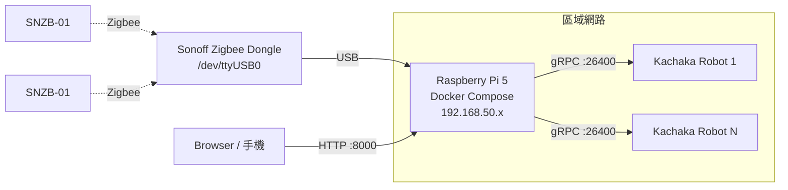
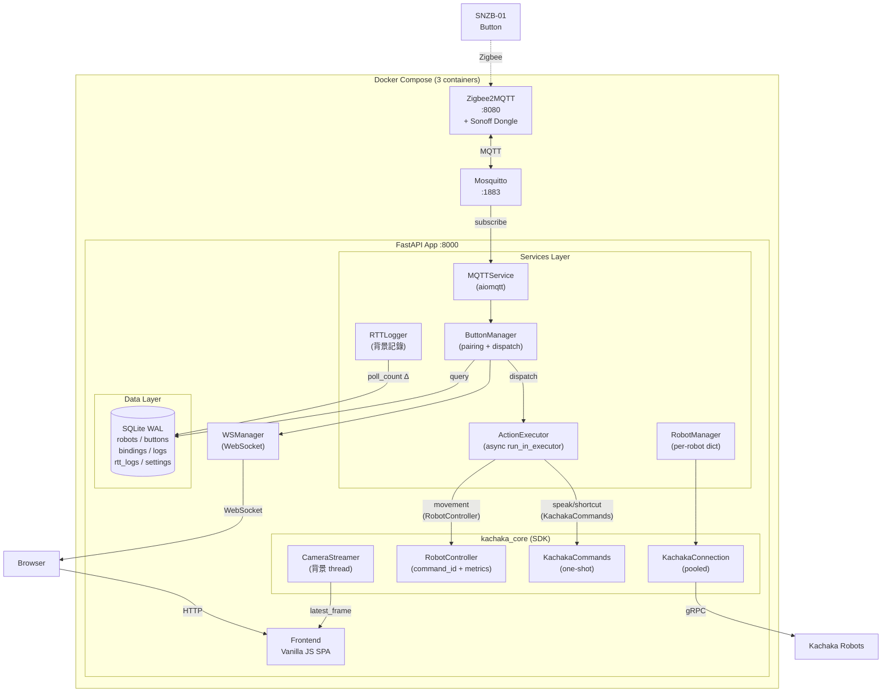
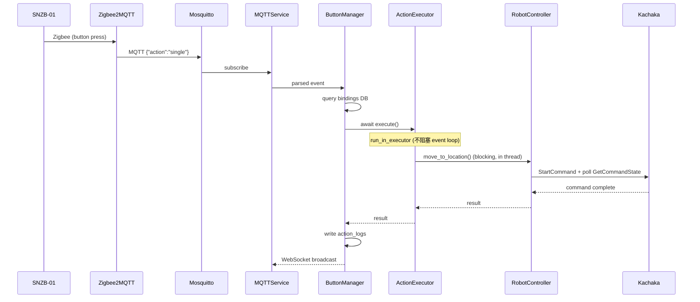
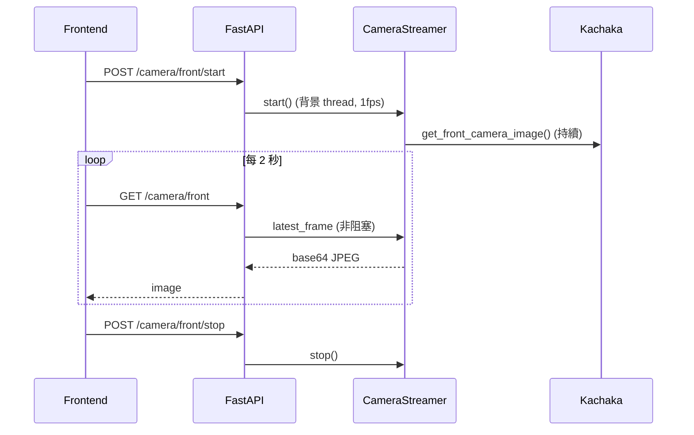
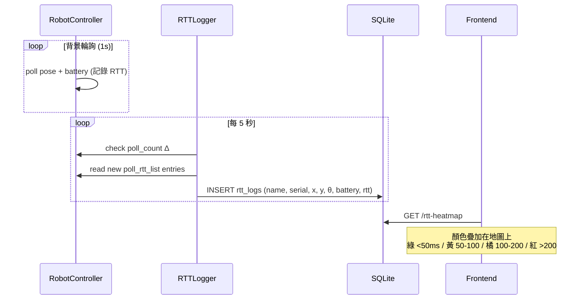

# Sigma 簡易控制介面

Raspberry Pi 5 上運行的 Zigbee 按鈕控制器。透過 Web UI 配對 SNZB-01 按鈕，綁定 Kachaka 機器人動作，按下即觸發。

## 功能

- **多機器人管理** — 動態新增/移除 Kachaka 機器人，RobotManager per-robot dict 架構
- **Zigbee 按鈕配對** — Web UI 一鍵 permit_join，自動偵測 SNZB-01
- **按鈕動作綁定** — 單擊/雙擊/長按各自綁定動作，參數從機器人即時載入
- **8 種動作** — 移動到位置、回充電座、語音播報、搬運/歸還貨架、對接/放下貨架、執行捷徑
- **機器人監控** — 即時地圖 + 位置、CameraStreamer 前後鏡頭串流、網路效能圖（RTT 熱力圖）
- **執行記錄** — 動作歷史含錯誤代碼、Telegram 通知
- **RWD** — 桌面/手機最佳化，手機版 FAB 浮動選單

## 硬體架構



## 軟體架構

遵循 [Kachaka App Architecture](https://github.com/Sigma-Snaken) 參考架構：FastAPI lifespan + RobotManager per-robot dict + SQLite WAL + Vanilla JS SPA。



### 架構決策對照

| 決策 | 本專案做法 | 架構指南建議 |
|------|-----------|-------------|
| Web framework | FastAPI + lifespan | FastAPI + lifespan |
| Multi-robot | RobotManager per-robot dict | Per-robot dict (非 per-container) |
| Robot SDK | `kachaka_core` (KachakaConnection.get) | `kachaka_core` — 禁止直接用 KachakaApiClient |
| 移動指令 | RobotController (command_id + metrics) | RobotController for multi-step |
| 快速指令 | KachakaCommands (speak/shortcut) | KachakaCommands for one-shot |
| 相機 | CameraStreamer (背景 thread) | CameraStreamer — 禁止 loop 呼叫 |
| Async 橋接 | `run_in_executor` (sync SDK → async) | `run_in_executor` 避免 block event loop |
| Database | SQLite + WAL + versioned migrations | SQLite + migrations |
| Frontend | Vanilla JS SPA (無 build tool) | Vanilla JS (solo) / React (team) |
| 即時通訊 | WebSocket broadcast | WebSocket per-robot |
| Container | Docker Compose, `--workers 1` | `--workers 1` — robot 是瓶頸 |
| Package | `uv` (Dockerfile + venv) | `uv` 取代 pip |
| CI/CD | GitHub Actions → GHCR (amd64+arm64) | CI 交叉編譯，禁止生產機 build |
| IPv4 | daemon.json + dns + sysctls | 三層 IPv4 強制 |

## 快速開始

### 首次部署

```bash
git clone https://github.com/Sigma-Snaken/pi-zigbee.git
cd pi-zigbee/deploy
chmod +x setup.sh && ./setup.sh
cd /opt/app/pi-zigbee
docker compose pull && docker compose up -d
```

### 開發環境

```bash
git clone https://github.com/Sigma-Snaken/pi-zigbee.git
cd pi-zigbee
docker compose up --build
# override.yml 自動套用：src/ volume mount + --reload
```

### 存取

| 服務 | URL |
|------|-----|
| 控制介面 | `http://<PI_IP>:8000` |
| Zigbee2MQTT | `http://<PI_IP>:8080` |

## 資料流

### 按鈕 → 機器人



### 鏡頭串流



### 網路效能圖 (RTT)



## 專案結構

```
pi-zigbee/
├── src/
│   ├── backend/
│   │   ├── main.py                  # FastAPI + lifespan (啟動順序: DB → Robot → MQTT → RTT)
│   │   ├── routers/
│   │   │   ├── robots.py            # CRUD + locations/shelves/shortcuts
│   │   │   ├── buttons.py           # CRUD + pair/stop
│   │   │   ├── bindings.py          # GET/PUT per button_id
│   │   │   ├── logs.py              # 分頁查詢
│   │   │   ├── monitor.py           # map, camera (CameraStreamer), rtt-heatmap
│   │   │   ├── settings.py          # system/info, notify (Telegram)
│   │   │   └── ws.py                # WebSocket
│   │   ├── services/
│   │   │   ├── robot_manager.py     # RobotManager + RobotService (kachaka_core 全套)
│   │   │   ├── action_executor.py   # async execute, RobotController/KachakaCommands 分流
│   │   │   ├── mqtt_service.py      # aiomqtt + Zigbee2MQTT 訊息解析
│   │   │   ├── button_manager.py    # 配對 + 綁定查詢 + 動作分派
│   │   │   ├── rtt_logger.py        # 背景 RTT + pose 記錄 (poll_count Δ)
│   │   │   ├── ws_manager.py        # WebSocket 廣播
│   │   │   └── notifier.py          # Telegram 通知
│   │   ├── database/
│   │   │   ├── connection.py        # aiosqlite + WAL + foreign_keys
│   │   │   └── migrations.py        # V1: 核心表, V2: settings, V3: rtt_logs
│   │   └── utils/
│   │       └── logger.py
│   └── frontend/
│       ├── index.html
│       ├── favicon.png
│       ├── css/style.css            # Vintage Command Terminal 主題 + RWD
│       └── js/
│           ├── app.js               # Tab 路由 + FAB 選單
│           ├── api.js               # REST API 封裝
│           ├── websocket.js         # WebSocket 自動重連
│           ├── robots.js            # 機器人 CRUD
│           ├── buttons.js           # 按鈕配對
│           ├── bindings.js          # 綁定設定 (含參數驗證)
│           ├── logs.js              # 執行記錄 + Telegram 設定
│           └── monitor.js           # 地圖 + CameraStreamer + RTT 熱力圖
├── data/                             # Runtime data (gitignored)
├── zigbee2mqtt/                      # Z2M config
├── mosquitto/                        # Mosquitto config
├── docker-compose.yml                # Dev: local build
├── docker-compose.override.yml       # Dev: volume mount + --reload
├── Dockerfile                        # Python 3.12-slim + uv
├── deploy/
│   ├── docker-compose.yml            # Prod: GHCR image + IPv4 enforcement
│   ├── daemon.json                   # Docker daemon IPv4
│   ├── setup.sh                      # 首次部署 + 桌面捷徑
│   └── .env.example
├── .github/workflows/build.yml       # CI: cross-compile amd64+arm64 → GHCR
├── requirements.txt
└── tests/                            # 37 tests
```

## API

| Method | Endpoint | 說明 |
|--------|----------|------|
| GET | `/api/health` | 健康檢查 |
| GET/POST/PUT/DELETE | `/api/robots` | 機器人 CRUD |
| GET | `/api/robots/{id}/locations` | 位置清單 |
| GET | `/api/robots/{id}/shelves` | 貨架清單 |
| GET | `/api/robots/{id}/shortcuts` | 捷徑清單 |
| GET | `/api/robots/{id}/map` | 地圖 + 即時位置 |
| GET | `/api/robots/{id}/camera/{front\|back}` | 鏡頭影像 (CameraStreamer) |
| POST | `/api/robots/{id}/camera/{cam}/start` | 啟動 CameraStreamer |
| POST | `/api/robots/{id}/camera/{cam}/stop` | 停止 CameraStreamer |
| GET | `/api/robots/{id}/rtt-heatmap` | RTT 資料點 + 統計 |
| DELETE | `/api/robots/{id}/rtt-heatmap` | 清除 RTT 資料 |
| GET/DELETE | `/api/buttons` | 按鈕列表/移除 |
| POST | `/api/buttons/pair` | 啟動配對 (120s) |
| PUT | `/api/buttons/{id}` | 重命名 |
| GET/PUT | `/api/bindings/{button_id}` | 綁定設定 |
| GET | `/api/logs?page=N` | 執行記錄 (分頁) |
| GET | `/api/system/info` | 系統 URL |
| GET/PUT | `/api/settings/notify` | Telegram 設定 |
| POST | `/api/settings/notify/test` | 測試通知 |
| WS | `/ws` | WebSocket 即時事件 |

## 測試

```bash
uv venv .venv && uv pip install -r requirements.txt
.venv/bin/pytest tests/ -v
# 37 tests: database, ws_manager, robot_manager, action_executor,
#           mqtt_service, button_manager, api, integration
```

## License

Copyright 2026 Sigma Robotics. Licensed under the [Apache License 2.0](LICENSE).
